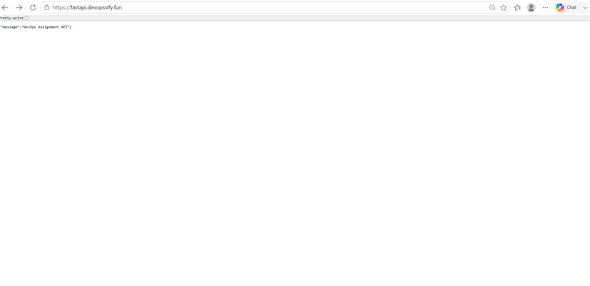
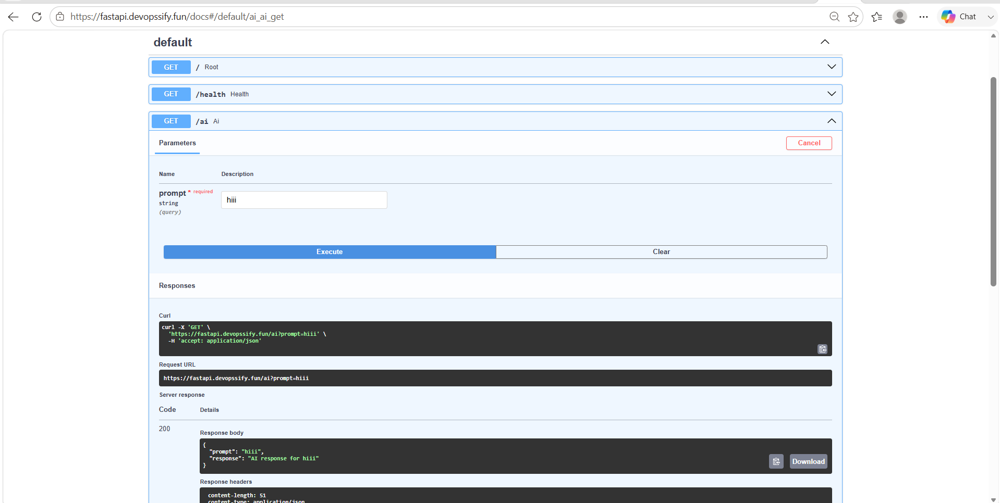

i have used the hostinger for domain mapping and then i have installl the let's encrypt certificate using below commands 
sudo apt update
sudo apt install certbot -y
sudo certbot certonly --standalone -d fastapi.devopssify.fun

](image.png)

